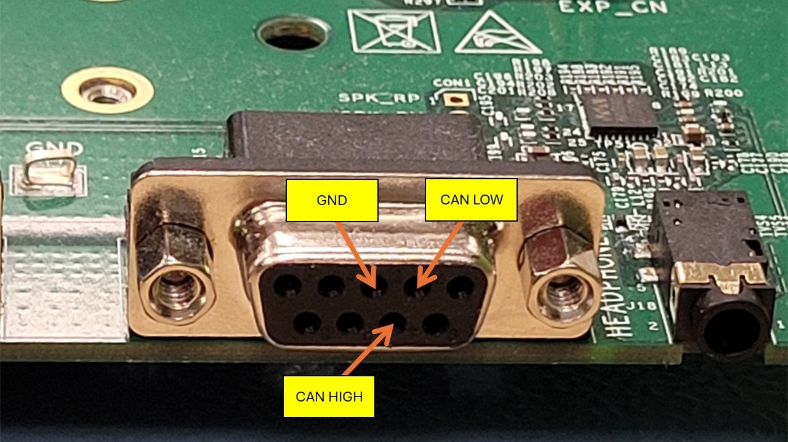
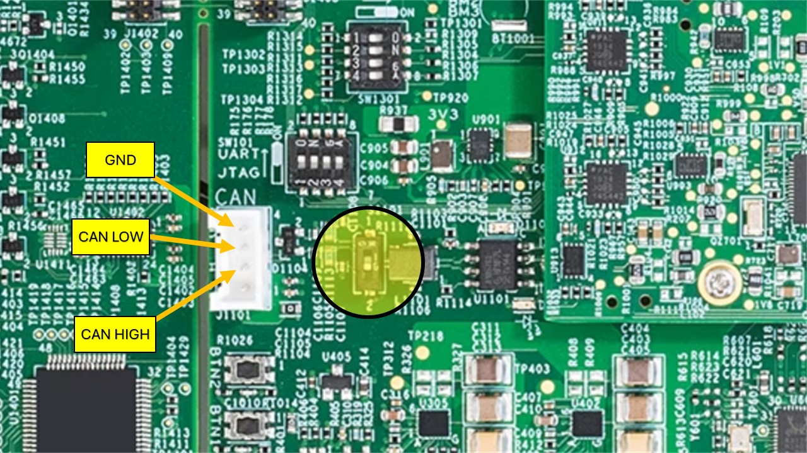

# GoPoint CAN Demo

 

NXP's *GoPoint for i.MX Applications Processors* unlocks a world of possibilities. This user-friendly app launches
pre-built applications packed with the Linux BSP, giving you hands-on experience with your i.MX SoC's capabilities.
Using the i.MX 8M Plus or i.MX 93 EVKs you can run the included *CAN Car Navigation* application available on GoPoint
launcher as apart of the BSP flashed on to the board. For more information about GoPoint, please refer to
[GoPoint for i.MX Applications Processors User's Guide](https://www.nxp.com/IMXLINUX?_gl=1*gz87wm*_ga*ODQxOTk0OTQwLjE3MDQ5ODk3NzA.*_ga_WM5LE0KMSH*MTcwNDk4OTc2OS4xLjEuMTcwNDk4OTgyOS4wLjAuMA..).

This demo is used to show can bus capabilities of i.MX boards. It uses CANOpen standard, more information here: [CANopenLinux](https://github.com/CANopenNode/CANopenLinux)

## Table of Contents

1.  [Hardware & Setup](#step1)
2.  [Software](#step3)
3.  [Release Notes](#step4)

## 1. Hardware and Setup

CAN Bus is using 2 wire in its simplest configuration, CAN High (CAN_H) and CAN Low (CAN_L). For connecting 2 boards it is required a Ground (GND) wire. 

**Make sure to connect the wires in the correct way (CAN_L to CAN_L, CAN_H to CAN_H, GND to GND)**

|   |          |
|-----------------------------------------------|-----------------------------------------------------|
|i.MX8MP evk CAN connector                      |i.MX93 evk CAN connector, termination resistor switch|

CAN Bus needs resistors to mark bus terminations. i.MX8MP has termination resistor integrated on evk and it is considered a termination. i.MX93 has a switch that enables the termination resistor, so it can be used as a bus termination or as an usual device. For most basic setup, including 2 boards, both must act as bus terminations, **so make sure to set terminal ressistor to ON**.

## 3. Software
## 4. Release Notes